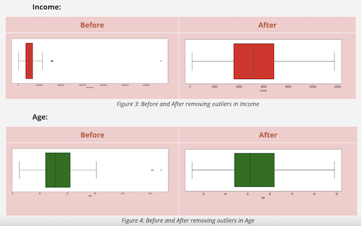
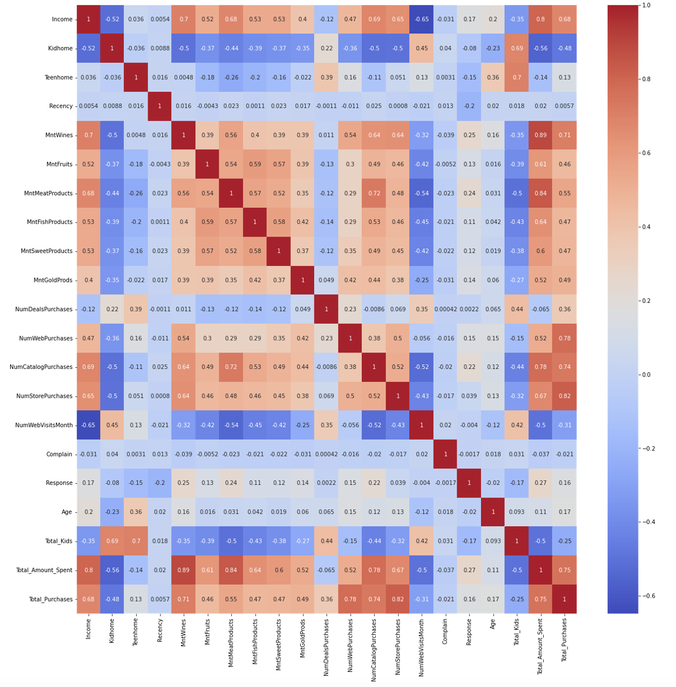
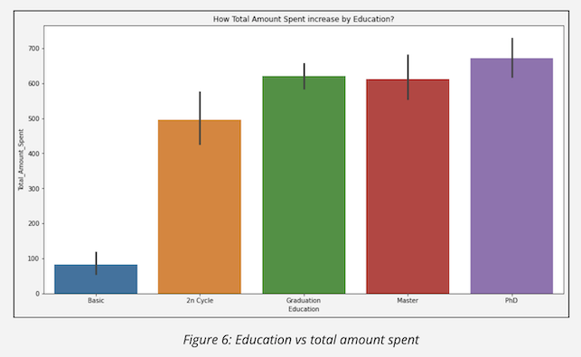
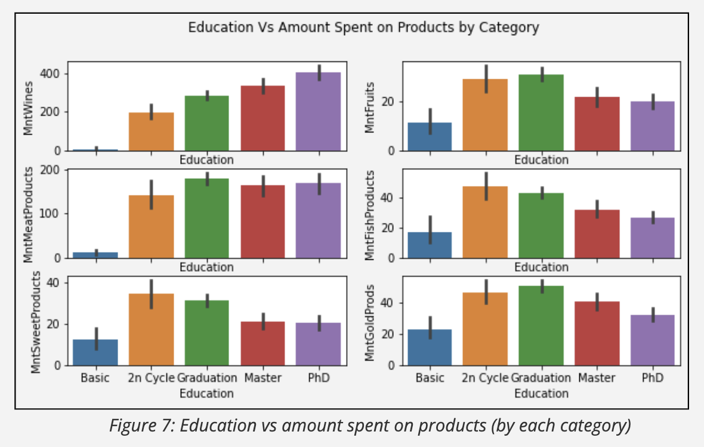

# Customer Personality Analysis

## Project Overview 
Customer analysis is used to help businesses identify the customers’ profiles needed for certain products. Since analyzing a completely new customer profile for every new product can be costly, by understanding customers’ buying behavior, marketing agencies can customize products or sale deals according to the customer’s needs and behaviors
#### Main Agenda: 
Learn the customer’s buying behaviors to increase our marketing effectiveness
Driving question is: "How would we improve marketing strategy by analyzing customers demographic?"
#### Key Data Description: 
* Customer’s education (Graduation, PHD, etc)
* Income
* Total Kids: number of kids and teenagers at home
* Teenhome: number of teenagers 
* Amount of different products purchased: wine, fruit, fish, etc
* Purchasing channels: websites, catalogs, in-store
* Number of web visit per month
* And many other attributes, learn more at https://www.kaggle.com/imakash3011/customer-personality-analysis

## Data Cleaning
* Fill in missing values with the mean of income 
* Remove unused attributes: AcceptedCmp1, AcceptedCmp2, AcceptedCmp3, AcceptedCmp4, AcceptedCmp5,Z_CostContact, Z_Revenue
* Add calculated fields: calculate customer's age from the column "Year"
* Combining similar data: narrow down marrital status, combine all number of kids, sum of purchase made, sum of the amount spent on all products
* Detect outliers: 

## EDA

The heatmap shows some strong correlations (either positive or negative) among customers’ demographics and the products and channels they use. 
* Customers’ income strongly correlates to products bought such as wine and meat. 
* Income correlates positively with store purchases and negatively with web purchases. 
* Customers’ age doesn’t show any strong correlation with either products or channels.

## Data Analysis & Findings

1. How does education impact products bought?

People with basic education tend to spend less in every product category. 

Education vs Individual Products:
* The higher the education, the higher the amount spent on Wines and Meat
* The higher the education, the lower the amount spent on Sweets, Fish
* Customers with Graduate education tend to buy more Meat, Gold, and Fruits than the other levels. 

2. How does the number of children affect the customer's buying channel?

